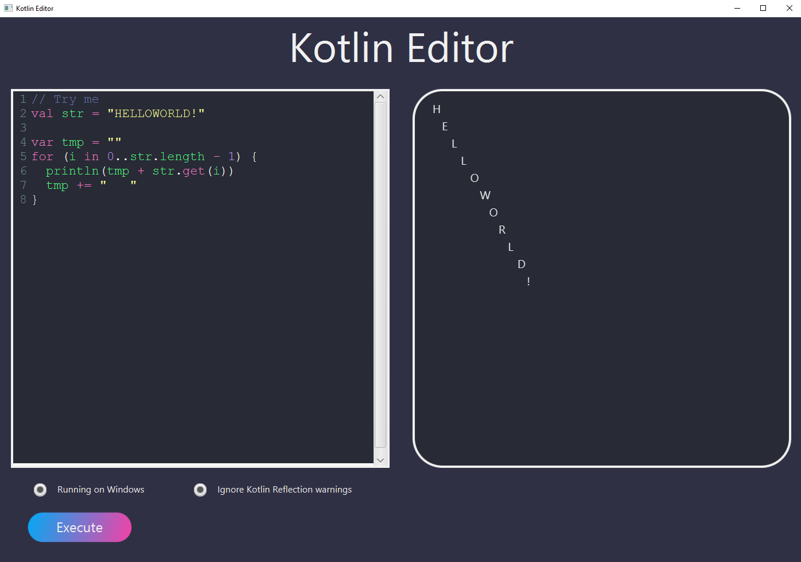

<h1 align="center">Kotlin IDE</h1>
<h4 align="center">By Danh Nguyen</h4>

 
<h4>1. Introduction</h4>

    GUI software intended to provide runtime environment
    and color-coded editor specifically for the Kotlin language.

<h4>2. Requirements</h4>
<ul>
    <li>Java Runtime Environment (JRE) 11.0 or higher</li>
    <li>Kotlin compiler <a href="https://github.com/JetBrains/kotlin/releases/tag/v1.4.21">here</a> </li>
    <li>Maven 3.0 or higher</li>
    <li>Proper working path especially on Windows machine</li>
    <li>Internet connection. Please note that our program need internet to work porperly</li>
</ul>

<h4>3. Instruction</h4>

    Compile the program via terminal with: 
    <code>
        mvn clean compile
    </code>  
    Then starts the application via: 
    <code>
        mvn javafx:run
    </code>

<h4>4. Interface</h4>
    
<ul>
    <li>Left-pane is editor</li>
    <li>Right-pane is terminal output</li>
    <li>If it is running on Windows, please check the option</li>
    <li>Check ignore warnings to suppress 
    <a href="https://stackoverflow.com/questions/56472732/kotlin-compiles-fine-but-keeps-warning-an-illegal-reflective-access-operation">Kotlin Reflection warnings</a></li>
</ul>

<h4>5. Acknowledgement</h4>

    Project implemented the open-source product of <a href="https://github.com/codemirror/codemirror">CodeMirror</a>,
    which <a href="https://github.com/codemirror/CodeMirror/blob/master/LICENSE">licensed</a> under the MIT license. All rights reserved to the respective owners.

